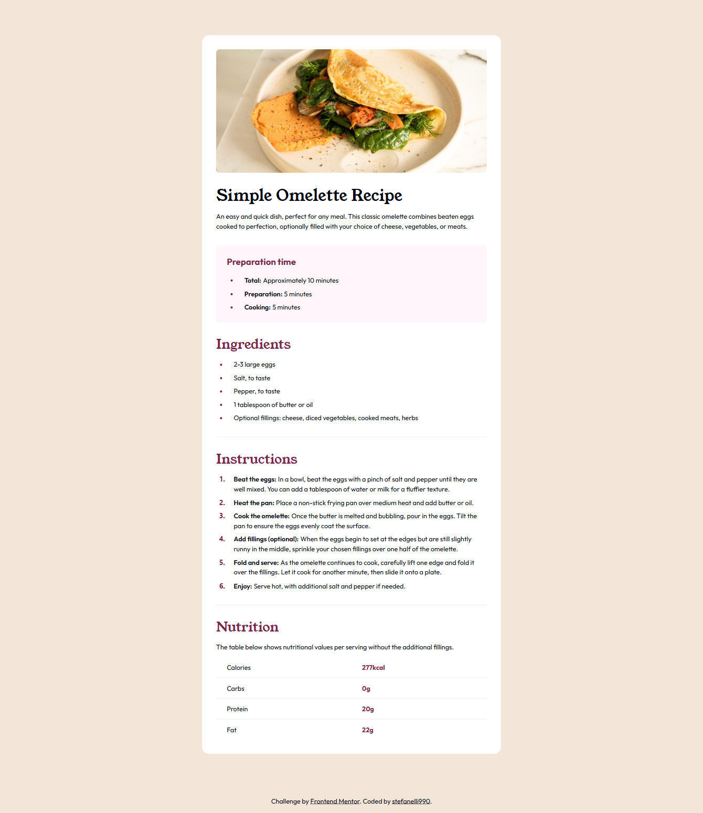

# Blog preview card

This is my solution for the [Blog preview card](https://www.frontendmentor.io/challenges/blog-preview-card-ckPaj01IcS), built using Tailwind CSS. The project was completed as part of the Frontend Mentor challenges to enhance my frontend development skills.

You can view the live demo of the project [here](https://stefanelli990.github.io/blog-preview-card/).
